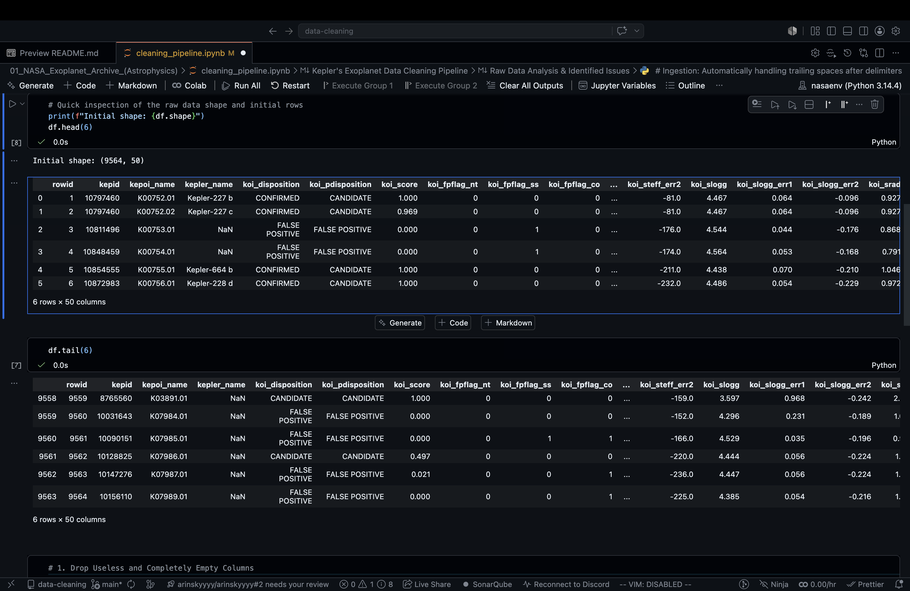
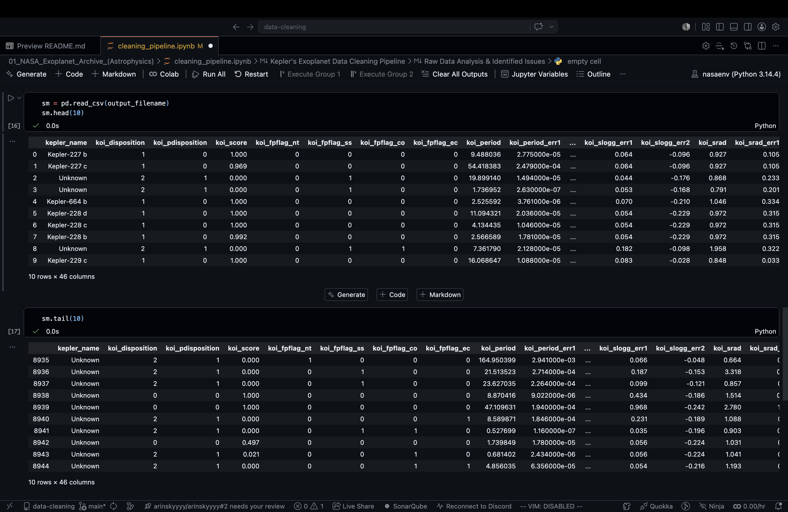

## Kepler's Exoplanet Data Cleaning Pipeline

**Project Overview**
This project focuses on the systematic cleaning and standardization of messy astrophysical records captured by the Kepler space telescope. The primary objective is to transform raw, noisy observations into a pristine dataset ready for machine learning and exploratory data analysis. 

**Technical Stack**
* **Languages:** Python
* **Libraries:** Pandas, NumPy
* **Concepts:** Data Cleaning Pipelines, Missing Value Imputation, Outlier Handling (Winsorization), Categorical Encoding

---

### Visual Proof: Before & After

**Before: The Raw Kepler Dataset**
*The raw data contained over 7,000 missing values, irrelevant database identifiers, and unencoded categorical text, making it incompatible with machine learning models.*

 

**After: The Cleaned, ML-Ready Pipeline Output**
*The fully processed dataset. All missing values are imputed, outliers are capped, and categorical variables are numerically encoded for immediate predictive modeling.*

---

### The Challenge: Raw Data Anomalies
The raw dataset initially contained 9,564 rows and 50 columns with several structural and qualitative issues:
* **Completely Empty Features:** Columns like `koi_teq_err1` and `koi_teq_err2` consisted entirely of missing values.
* **Irrelevant Identifiers:** Database artifacts such as `rowid`, `kepid`, and `kepoi_name` offered no predictive or analytical value.
* **Extensive Missing Data:** Over 7,000 missing values existed in naming columns, and nearly 500 missing values were found across numerical error metrics and target scores.
* **Extreme Outliers:** Crucial continuous variables exhibited extreme maximum values that skewed the data distribution.
* **Incompatible Data Types:** Target variables were stored as strings, making them incompatible with standard machine learning algorithms.

---

### The Solution: Automated Cleaning Pipeline
To address these issues, I engineered a robust, automated Python script leveraging Pandas to systematically process the data. 

**Key Pipeline Stages:**

1. **Smart Ingestion & Trimming:** * The pipeline automatically strips trailing spaces after delimiters during the CSV read process to ensure clean string matching. 
   * It dynamically prompts the user for the input filename and generates a labeled output file.
2. **Dimensionality Reduction (Feature Selection):** * Completely empty columns (`koi_teq_err1`, `koi_teq_err2`) and irrelevant identifiers (`rowid`, `kepid`, `kepoi_name`) were systematically dropped.
3. **Targeted Imputation:** * Missing categorical designations in `kepler_name` were filled with "Unknown".
   * Missing continuous values in error metric columns (any containing `err1` or `err2`) and the `koi_score` were imputed using their respective column medians to maintain distribution integrity.
4. **Target Variable Sanitization:** * Rows completely missing the critical target variable (`koi_disposition`) were dropped to ensure the dataset remains viable for supervised learning.
5. **Outlier Capping (Winsorization):** * Extreme maximums in `koi_period`, `koi_prad`, and `koi_insol` were capped at the 99th percentile.
6. **Machine Learning Readiness:** * Categorical targets (`koi_disposition`, `koi_pdisposition`) were converted to numerical codes. 
   * `koi_tce_delivname` was transformed using one-hot encoding (dummy variables), dropping the first category to prevent multicollinearity.

---

### Project Results & Impact
The pipeline successfully transformed the raw, messy file into a streamlined, ML-ready dataset. 

* **Initial Shape:** 9,564 rows × 50 columns.
* **Final Shape:** 8,945 rows × 46 columns.
* **Data Integrity:** 0 remaining missing values across the entire finalized dataframe.
* **Output:** The pipeline successfully exports a clean, encoded, and outlier-managed `.csv` file ready for downstream predictive modeling.