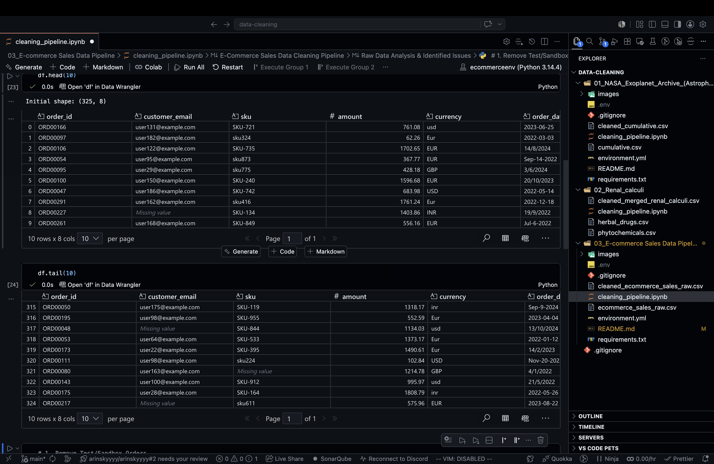
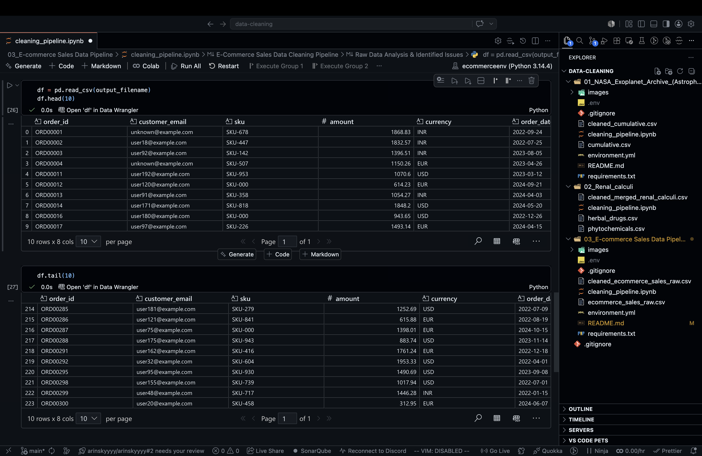

# E-Commerce Data Cleaning

This is a simple Python pipeline using Pandas to clean up messy e-commerce sales data so it's ready for analysis.

## What it does
- Removes fake "test" and "sandbox" orders.
- Fills in missing emails and product SKUs so things don't break.
- Fixes SKU formatting so they all look identical (e.g., `SKU-XXXX`).
- Converts messy, mixed dates into a standard `YYYY-MM-DD` format.
- Removes duplicate orders while keeping any important order notes.

## Before & After
Here is a look at what the data looks like before and after running the script:

**Before (Raw Data):**

 

**After (Cleaned Data):**

## How to use it
1. Make sure you have pandas installed on your computer: 
   `pip install pandas`
2. Open the `cleaning_pipeline.ipynb` notebook.
3. Run all the cells.
4. When prompted, type in the name of your raw data file (e.g., `01_ecommerce_sales_raw.csv`).
5. The script will automatically clean the data and save a new file starting with `cleaned_` in the same folder.

## Files included
- `cleaning_pipeline.ipynb`: The actual Python code.
- `01_ecommerce_sales_raw.csv`: The original messy dataset.
- `cleaned_01_ecommerce_sales_raw.csv`: The final, cleaned dataset.s