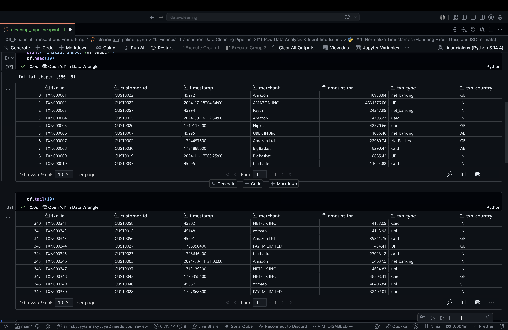
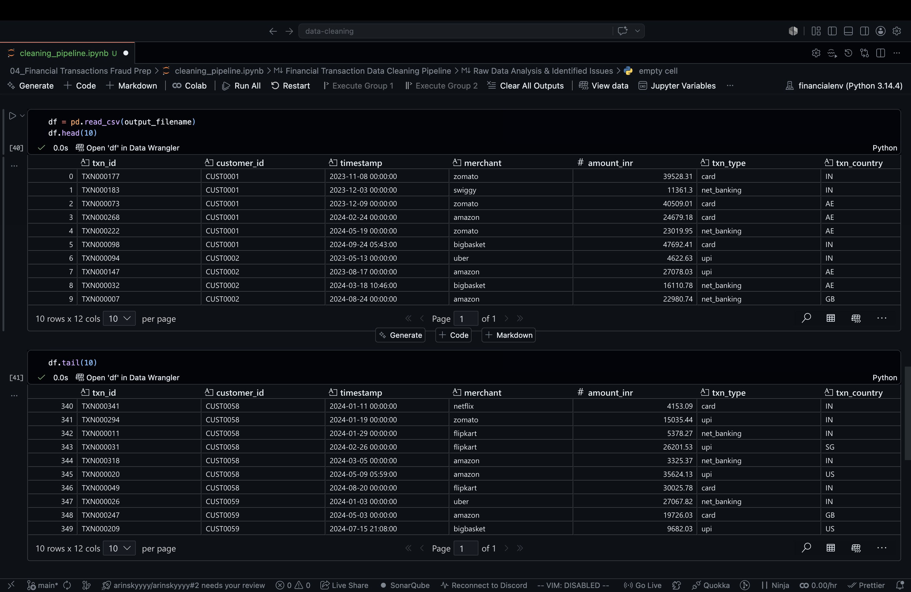

#  Financial Transaction Data Cleaning Pipeline

**Status:** Completed  
**Role:** Data Engineer / Analyst  
**Focus:** Python, Pandas, Feature Engineering, Data Cleaning Pipelines.

##  Project Overview

This project focuses on cleaning, standardizing, and engineering features for a dataset of messy financial transactions intended for fraud detection analysis. The pipeline demonstrates the ability to handle severe data inconsistencies, perform critical dimensionality reduction, and engineer new temporal and risk-based features essential for machine learning models.

##  Data Transformation

### Before Cleaning
*(The raw dataset showing inconsistent timestamps, fragmented merchant names, and extreme outliers.)*

 

### After Cleaning
*(The processed dataset with engineered temporal features, consolidated categories, risk flags, and winsorized limits.)*

---

##  The Challenge

The raw dataset suffered from several significant data quality and formatting problems that would prevent any meaningful analysis or model training:

1.  **Inconsistent Timestamps:** The `timestamp` column contained a messy mixture of Excel serial dates, Unix timestamps, and ISO strings, requiring complex parsing and explicit casting to `datetime64`.
2.  **Inconsistent Entity Names:** The `merchant` column suffered from severe data entry variations and differing legal suffixes (e.g., 'Amazon', 'AMAZON INC', 'Amazon Ltd').
3.  **Case Inconsistencies:** The `txn_type` column contained duplicate categories differing only by capitalization (e.g., 'upi' vs 'UPI', 'net_banking' vs 'NetBanking').
4.  **Extreme Outliers:** The `amount_inr` column had extreme maximums (up to ₹4.6M) that would severely skew machine learning models, requiring Winsorization.
5.  **Zero-Variance Feature & Risk Flagging:** The `card_issue_country` column contained exactly 1 unique value ('IN') across all rows. However, before dropping it, it was necessary to cross-reference it with `txn_country` to flag high-risk, cross-border transactions.
6.  **Missing Temporal Features:** Machine learning models cannot natively read raw datetimes, requiring the engineering of time-based patterns.

##  The Solution & Pipeline

I developed a Python-based pipeline using `pandas` and `numpy` to systematically clean and enhance the dataset. The pipeline follows these key stages:

### Phase 1: Data Ingestion & Timestamp Normalization
* Ingested the raw data, automatically handling trailing spaces after delimiters (`skipinitialspace=True`).
* Developed a custom parsing function (`standardize_timestamp`) to dynamically identify and convert Unix timestamps, Excel Serial dates, and ISO formats into a standardized, explicit `datetime64` format.

### Phase 2: Feature Engineering (Temporal Data)
* Engineered `hour_of_day` and `is_weekend` features directly from the normalized timestamps.
* Calculated `days_since_last_txn` by sorting transactions per customer and computing the time delta between sequential events.

### Phase 3: Text Standardization
* Consolidated diverse merchant names by converting text to lowercase, stripping whitespace, and programmatically removing corporate suffixes (`inc`, `ltd`, `pvt ltd`, `limited`).
* Applied manual mapping to fix specific known typos (e.g., standardizing "big basket" to "bigbasket").
* Standardized transaction types by enforcing uniform lowercase naming conventions.

### Phase 4: Winsorization & Outlier Capping
* Applied Winsorization at the 99th percentile for the `amount_inr` column. Crucially, this capping was calculated and applied *dynamically per transaction type* to ensure extreme, yet legitimate, transactions weren't inappropriately squashed.

### Phase 5: Risk Flagging & Dimensionality Reduction
* Engineered a new `high_risk` binary flag by comparing the `txn_country` against the `card_issue_country` (flagging transactions occurring outside the issuing country).
* Programmatically dropped the `card_issue_country` column after risk extraction, as its zero-variance nature offered no remaining predictive power.

##  Results

* Successfully normalized all timestamps into a usable format.
* Consolidated fragmented merchant names down to exactly 8 clean, uniform categories.
* Standardized transaction types to just 3 distinct categories.
* Capped extreme outliers appropriately, preventing analytical skew.
* Engineered 4 entirely new features (`hour_of_day`, `is_weekend`, `days_since_last_txn`, `high_risk`) to directly support downstream machine learning objectives.
* Successfully output a pristine dataset, ready for fraud detection modeling.

##  Tech Stack
* **Language:** Python
* **Libraries:** Pandas, NumPy
* **Environment:** Jupyter Notebook / Local IDE
* **Version Control:** Git, GitHub