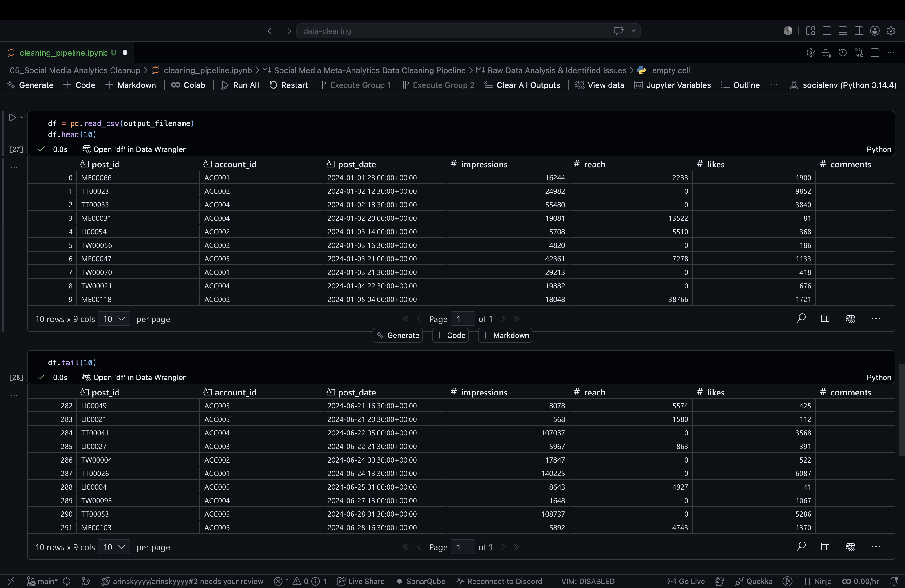

#  Omnichannel Social Media Analytics Pipeline

**Status:** Completed  
**Role:** Data Engineer / Analyst  
**Focus:** Python, Pandas, Data Integration, Temporal Normalization, Data Cleaning Pipelines.

##  Project Overview

This project focuses on unifying, cleaning, and standardizing fragmented social media performance datasets across four major platforms (Meta, X/Twitter, LinkedIn, TikTok) into a single, analysis-ready source of truth. The pipeline demonstrates the ability to map proprietary schemas to a standardized funnel, resolve critical timezone ambiguities, and filter polluted data to ensure analytical integrity.

##  Data Transformation

### After Cleaning
*(The unified, omnichannel dataset with standardized UTC time, a consistent metric funnel, and filtered test accounts.)*

---

##  The Challenge

The raw data was provided in four separate CSV files, each suffering from platform-specific architectures that made cross-platform analysis impossible without severe intervention:

1.  **Fragmented Schemas:** Each platform utilized proprietary naming conventions for identical engagement metrics (e.g., Twitter's `favourites` vs. Meta's `likes`, TikTok's `video_views` vs. LinkedIn's `impressions`).
2.  **Timezone Ambiguity:** The `post_date` column contained mixed, unparsed timezone strings (`UTC`, `IST`). Crucially, abbreviations like `IST` are ambiguous and cause modern parsing engines to fail without explicit offset mapping.
3.  **Polluted Data Streams:** The datasets contained records from internal test accounts (`TEST001`, `INTERNAL02`), which would artificially inflate engagement metrics and ruin downstream analytics.
4.  **Concatenation Voids (NaNs):** Merging datasets with differing architectures (like LinkedIn's `unique_views` or TikTok's lack of `shares`) inherently introduces structural `NaN` values that must be handled numerically.

##  The Solution & Pipeline

I developed a Python-based pipeline using `pandas` and `numpy` to systematically ingest, map, and integrate the data. The pipeline follows these key stages:

### Phase 1: Ingestion & Schema Standardization
* Ingested all four datasets, automatically handling trailing spaces after delimiters (`skipinitialspace=True`).
* Mapped proprietary column headers to a unified, standard funnel nomenclature (e.g., standardizing `views` and `video_views` to `impressions`, and `retweets` to `shares`).

### Phase 2: Data Integration
* Executed a structural concatenation, vertically stacking the datasets into a single, unified dataframe, forcing missing architectural columns to align.

### Phase 3: Temporal Normalization
* Addressed the ambiguous timezone error by explicitly mapping string abbreviations (`IST`, `UTC`) to their actual numeric offsets (`+05:30`, `+00:00`).
* Parsed and explicitly cast the normalized strings into uniform `datetime64[ns, UTC]` objects, enabling accurate cross-platform time-series analysis.

### Phase 4: Data Quality & Imputation
* Programmatically filtered out polluted data originating from known internal test accounts.
* Addressed the structural `NaN` values introduced during concatenation by dynamically filling voids in engagement metrics with `0` and explicitly casting them to integers.
* Sorted the final unified dataset chronologically by `post_date`.

##  Results

* Successfully merged 4 proprietary data schemas into 1 unified source of truth.
* Resolved fatal timezone parsing errors by explicitly mapping ambiguous offsets, achieving 100% UTC conformity.
* Removed internal data pollution, ensuring the integrity of engagement metrics.
* Successfully output a pristine, integrated dataset, ready for cross-platform funnel analysis or dashboard ingestion.

##  Tech Stack
* **Language:** Python
* **Libraries:** Pandas, NumPy
* **Environment:** Jupyter Notebook / Local IDE
* **Version Control:** Git, GitHub